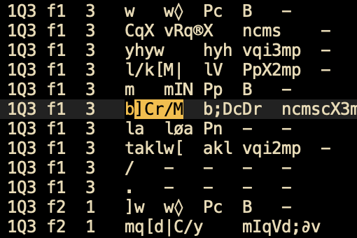

Feature documentation
=====================

Here you find a description of the transcriptions of the Dead Sea Scrolls (DSS),
the Text-Fabric model in general, and the node types, features of the
DSS corpus in particular.

See also [about](about.md) [text-fabric](textfabric.md)

Conversion from Abegg's data files to TF
-------------------------

Below is a description of document transcriptions in
DSS (see below)
and an account how we transform them into
[Text-Fabric](https://annotation.github.io/text-fabric/) format by means of
[tfFromAbegg.py](../programs/tfFromAbegg.py).

The corpus consists of two files, one for the non-biblical scrolls and one for the 
biblical scrolls. In both files, the material is subdivided into *scroll*, *fragment*, *line*.
In the biblical file, *book*, *chapter* and *verse* are also marked.

Every line in both files has a fields for

* transcription
* lexeme
* morphological tags

and a bit of extra information.

The Text-Fabric model views the text as a series of atomic units, called
*slots*. In this corpus [*signs*](#sign) are the slots.

On top of that, more complex textual objects can be represented as *nodes*. In
this corpus we have node types for:

[*sign*](#sign),
[*word*](#word),
[*cluster*](#cluster),
[*line*](#line),
[*fragment*](#fragment),
[*scroll*](#scroll),
[*halfverse*](#halfverse),
[*verse*](#verse),
[*chapter*](#chapter),
[*book*](#book).

The type of every node is given by the feature
[**otype**](https://annotation.github.io/text-fabric/Api/Features/#node-features).
Every node is linked to a subset of slots by
[**oslots**](https://annotation.github.io/text-fabric/Api/Features/#edge-features).

Nodes can be annotated with features. See the table below.

Text-Fabric supports up to three customizable section levels.
In this corpus we use:
[*scroll*](#scroll) and [*fragment*](#fragment) and [*line*](#line).

Note that we do have node types corresponding to *book*, *chapter*, and *verse*,
but they are not configured as TF-sections.

Transcription
--------------
We map the transcriptions and lexemes to Hebrew unicode.
The transcriptions are consonant only, the lexemes are pointed.
The vowels we encounter in the source data
been transcribed by one or more special characters, probably
in order to fine-tune the position of those points with respect to their
consonants.
We reduce them to the Hebrew unicodes.

We also supply the ETCBC transcription for Hebrew material.
For the full details see the extensive
[Hebrew transcription table](https://annotation.github.io/text-fabric/Writing/Hebrew.html).

Other docs
----------

[Text-Fabric API](https://annotation.github.io/text-fabric)

[DSS API](https://annotation.github.io/app-dss/blob/master/api.md)

Reference table of features
===========================

*(Keep this under your pillow)*

Some features come in three variants, with the last letter being:

* **a** the original transcription (Abegg)
* **e** the ETCBC transcription, or something that fits into ETCBC transcriptions
* **u** the unicode value

Node type [*sign*](#sign)
-------------------------

Basic unit containing a single symbol, mostly a consonant, but it can also be 
punctuation, or a text-critical sign.

The type of sign is stored in the feature `type`.

type | examples | rewritten/etcbc | unicode | description
------- | ------ | ------ | --- | ---
`consonant` | `m` `M` | `M` `m`| `מ` `ם` | normal consonantal letter
`punctuation` | ` ` `-` `.` `±` `/`| `_` `&` `00` `62` `61`| ` ` `־` `׃` `״` `׳`| non-breaking space, maqaf, sof pasuq, paleo divider, morpheme break 
`numeral` | `A` `B` `C` `D` `F` `å` `∫`  | ` 1A ` ` 1B ` ` 10 ` ` 20 ` ` 100 ` ` 1a ` ` 1f ` | ` 1A ` ` 1B ` ` 10 ` ` 20 ` ` 100 ` ` 1a ` ` 1f ` | a numeral, only in words that are a numeral as a whole
`missing` | `--` | ` 0 ` | `ε` | representation of a missing sign
`uncertain` | `?` | ` ? ` | ` ? ` | representation of an uncertain sign (degree 1)
`uncertain` | ``\`` | ` # ` | ` # ` | representation of a uncertain sign (degree 2)
`uncertain` | `�` | ` #? ` | ` #? `| representation of an uncertain sign (degree 3)
`add` | `+` | ` + ` | `+` | representation of an addition between numerals

feature | values | Abegg | ETCBC | Unicode | description
------- | ------ | ------ | ----------- | --- | ---
**alternative** | `1` | `lwz/)h(` | `LWZ61(H)` | | indicates an alternative material, marked by being within brackets `( )`
**correction** | `1` | `yqw>mw<N` | `JQW(< MW >)n` | | material is corrected by a modern editor, marked by being within single angle brackets  `< >`
**correction** | `2` | `>>zwnh«<<` | `(<< ZWNH# >>)` | | material is corrected by an ancient editor, marked by being within double angle brackets  `<< >>`
**correction** | `3` | `^dbr/y^` | `(^ DBR ? J ^)` | | material is corrected by an ancient editor, marked by being within double angle brackets  `<< >>`
**reconstruction** | `1` | `]p[n»y` | `[P]N#?Y` | | material is reconstructed by a modern editor, marked by being within square brackets  `[ ]`
**removed** | `1` | `}m«x«r«yØM«{` | `{M#Y#R#J?m#}` | | material is removed by a modern editor, marked by being within single braces  `{ }`
**removed** | `2` | `twlo}}t{{` | `TWL<{{t}}` | | material is removed by an ancient editor, marked by being within double braces  `{{ }}`
**glyph[aeu]** | | `m` | `M` | `מ` | transliteration of an individual sign
**type** | | | | | type of sign, see table above
**uncertain** | `1` | `b«NØ` | `B#n?` | | indicates *uncertainty of degree=1* by flag `|`
**uncertain** | `2` | `at«` `aj«y»/K` | `>T#` `>X#J#?) ? k` | | indicates *uncertainty of degree=2* by flag `«` or brackets `« »`
**uncertain** | `3` | `]p[n»y` | `[P]N#?Y` | | indicates *uncertainty of degree=3* by flag `»`
**uncertain** | `4` | `a\|hrwN` | `>#?HRWn` | | indicates *uncertainty of degree=4* by flag `\|`
**vacat** | `1` | `≥ ≤` | `(- -)` | | indicates an empty, unwritten space by brackets `≤ ≥`

Node type [*word*](#word)
-------------------------
Sequence of signs separated corresponding to a single line in the Abegg data files.
If a word is adjacent to a next word, the Abegg data file has `B` in a certain column,
and we leave the *after* feature without value.

feature | Abegg | ETCBC | Unicode | description
------- | ------ | ------ | --- | --------
**after** | ` ` | | | whether there is a space after a word and before the next word
**letters[aeu]** | `mmnw` | `MMNW]` | `ממנו` | letters of a word excluding flags and brackets and punctuation, but with white space
**punc[aeu]** | `.` | `00` | `׃` | punctuation at the end of a word
**trans[aeu]** | `mm/nw[` | `MM61NW]` | `ממ׳נו]` | full transcription of a word, including flags and clustering characters

Node type [*cluster*](#cluster)
-------------------------------

Grouped sequence of [*signs*](#sign). There are different
types of these bracketings. Clusters of the same type are not nested.
Clusters of different types need not be nested properly with respect to each other.

The type of a cluster is stored in the feature `type`.

This is a summary of the source encoding, see also the features at the sign level with the same names above.

type | value | examples | description
------- | ------ | ------ | ---
`correction` | `1` | `< >` | correction made by a modern editor
`correction` | `2` | `<<  >>` | correction made by an ancient editor
`correction` | `3` | `^ ^` | supralinear (ancient) correction
`removed` | `1` | `{ }` | removed by a modern editor
`removed` | `2` | `{{  }}` | removed by an ancient editor
`reconstruction` | `1` | `[ ]` | reconstructed by a modern editor
`vacat` | `1` | `≤ ≥` | empty space
`alternative` | `1` | `( )` | alternative
`uncertain` | `1` `2` `3` `4` | `« »` | uncertain, with level of uncertainty

Each cluster induces a sign feature with the same name as the type of the cluster,
which gets a numeric value, as indicated in the table.

Node type [*line*](#line)
-------------------------

Section level 3.

Subdivision of a containing [*fragment*](#fragment).
Corresponds to a set of source data lines with the same value in the *line* column.

feature | values | description
------- | ------ | ------
**number** | `3` | number of a physical line (integer valued)

Node type [*fragment*](#fragment)
-------------------------

Section level 2.

Subdivision of a containing [*scroll*](#scroll).
Corresponds to a set of source data lines with the same value in the *fragment* column.

For non-biblical scrolls, the fragment is usually called *column*. 

feature | values | description
------- | ------ | ------
**label** | `f3` | label of a physical fragment or column

Node type [*scroll*](#scroll)
-------------------------

Section level 1.

Corresponds to a set of source data lines with the same value in the *scroll* column.

feature | values | description
------- | ------ | ------
**acro** | `1Q1` | short name of a physical scroll

Node type [*halfverse*](#halfverse)
-------------------------

Only for biblical scrolls. Not a section type.

Subdivision of a containing [*verse*](#verse).
Corresponds to a set of source data lines with the same non-numerical part in the *verse* column.

Not every verse is divided in half verses.

feature | values | description
------- | ------ | ------
**number** | `3` | number of its containing part
**label** | `a` | the non-numerical part of the verse number

Node type [*verse*](#verse)
-------------------------

Only for biblical scrolls. Not a section type.

Subdivision of a containing [*chapter*](#chapter).
Corresponds to a set of source data lines with the same numerical part in the *verse* column.

The division in verses may or may not coincide with the division in lines.

feature | values | description
------- | ------ | ------
**number** | `3` | number of a verse line (integer valued), without the non-integer part

Node type [*chapter*](#chapter)
-------------------------

Only for biblical scrolls. Not a section type.

Subdivision of a containing [*book*](#book).
Corresponds to a set of source data lines with the same value in the *chapter* column.

The division in chapters may or may not coincide with the division in fragments.

feature | values | description
------- | ------ | ------
**label** | `6` `f6` | label of a chapter

Node type [*book*](#book)
-------------------------

Only for biblical scrolls. Not a section type.

Corresponds to a set of source data lines with the same value in the *book* column.

The division in books may or may not coincide with the division in scrolls.

feature | values | description
------- | ------ | ------
**acro** | `Gen` `1Q1` | short name of a book

Slots
=====

Slots are the textual positions.
They are be occupied by individual signs (consonants, punctuation, miscellaneous signs).

We discuss the node types we are going to construct. A node type corresponds to
a textual object. Some node types will be marked as a section level.

Sign
----

This is the basic unit of writing.

**The node type [*sign*](#sign) is our slot type in the Text-Fabric representation of this corpus.**

All signs have the features **type** and **glyph[aeu]**.

The *type* stores the kind of glyph, such as `consonant`.
The *glypha glyphe glyphu* features store the transcription of the glyph, without any flags
and brackets. They store it in the Abegg transcription, ETCBC transcription, and in Unicode.

These features do not suffice to reconstruct the original Abegg transcription.

### Punctuation

Punctuation is either a mark or a white space, or a boundary.
All punctuation characters have Unicode representations.
For some we have *borrowed* a Hebrew character that has a different meaning in the Masoretic text,
but that does not occur otherwise in the Dead Sea Scrolls.
The reason is that we can represent Hebrew consonants plus punctuation in a smooth,
right-to-left way.

source | etcbc | unicode | description
--- | --- | --- | ---
` ` | `_` | ` ` | non-breaking intra-word space
`-` | `&` | `־` | maqaf
`.` | `00` | `׃` | sof pasuq
`±` | `62` | `״` | gershayim (mis)used as paleo divider 
`/` | `61` | `׳` | geresh (mis)used as morpheme break

### Numerals

Numerals are ancient signs for denoting quantities.

source | etcbc/unicode
--- | ---
`A` | ` 1A `
`å` | ` 1a `
`B` | ` 1B `
`∫` | ` 1b `
`C` | ` 10 `
`D` | ` 20 `
`F` | ` 100 `

There is no separate Unicode representation for these numerals.
Their ETCBC transcription is surrounded by spaces.

### Miscellaneous

Several characters have to do with uncertainty and illegibility.
They have an improvised Unicode representations.
We propose an transcription that works inside the ETCBC transcription.
Note that these have spaces around them.

source | etcbc | unicode | description
--- | --- | --- | ---
`--` | ` 0 ` | `ε` | missing sign
`?` | ` ? ` | ` ? ` | uncertain sign, note spaces around the unicode representation
``\`` | ` ~ ` | `~` | doubtful sign
`�` | ` ! ` | `!` | doubtful sign
`+` | ` + ` | `+` | addition symbol between numerals

Signs also have features corresponding to flags and brackets, that store under which flag
or inside which brackets the sign occurs:
**uncertain** **correction** **remove** **vacat** **alternative** **reconstruction**.

### Flags ###

*Signs* may have *flags*.
In transcription they show up as a special trailing character.
Flags code for signs that are damaged, questionable (in their reading), in short: uncertain.

We propose an transcription that works inside the ETCBC transcription.
Note that these have *no* spaces around them.

We use this for the Unicode represenatation as well.

source | etcbc / unicode | description
--- | --- | ---
`Ø` | `?` | uncertain, degree 1
`«` | `#` | uncertain, degree 2
`»` | `#?` | uncertain, degree 3
`\|` | `##` | uncertain, degree 4

Note that there is also a bracket pair for uncertainty level 2.

### Brackets

We discuss the brackets under the node type [*cluster*](#cluster).
Each type of bracket corresponds to a feature of the same name at the *sign* level.

With some difficulty, you can reconstruct the Abegg source from this, modulo the order
of flags and brackets. 

The recommended way to reconstruct the original transcriptions by Abegg is to go to the
word level.

The other nodes
===============

Cluster
-------

One or more [*signs*](#sign) may be bracketed by certain delimiters.
Together they form a *cluster*.

Each pair of boundary signs marks a cluster of a certain type.
This type is stored in the feature **type**.

Clusters are not be nested in clusters of the same type.

Clusters of one type in general do not respect the boundaries of clusters of other types.

Clusters may contain just one [*sign*](#sign).

Cluster boundaries are usually within words.

In Text-Fabric, cluster nodes are linked to the signs it contains.
So, if `c` is a cluster, you can get its signs by 

    L.d(c, otype='sign')

More over, every type of cluster corresponds to a numerical feature on signs with the same name
as that type.

We propose an transcription that works inside the ETCBC transcription.
Note that these have *sometimes* a space at the inner side.

We use the original brackets for the Unicode representation as well.
But note that in the original the direction of the brackets is inverted, due to the conversion process
that has stripped RTL and LTR triggering characters.
In the Unicode representation we restore the proper direction.

In the table below, the *value* is the value that the associated feature has for 
signs within that type of brackets under the given description.

source / unicode | etcbc | value | description
--- | --- | --- | ---
`^ ^` | `(^ ^)` | 3 | correction by ancient editor, supralinear
`>> <<` | `(<< >>)` | 3 | correction by ancient editor, supralinear
`>> <<` | `(<< >>)` | 2 | correction by ancient editor
`> <` | `(< >)` | 1 | correction by modern editor
`}} {{` | `({{ }})` | 2 | removed by ancient editor
`} {` | `({ })` | 1 | removed by modern editor
`≥ ≤` | `(- -)` | 1 | vacat: an empty, unwritten space in the manuscript
`) (` | `( )` | 1 | alternative reading
`] [` | `[ ]` | 1 | modern reconstruction
`» «` | `(# #)` | 2 | uncertainty of degree 2

Word
----

Words are the contents of the transcription fields of the source data lines.
Words will be separated by spaces and punctuation, or by nothing, in case the
connection field in the same source data line has a `B`. 

They have features **letters[aeu] trans[aeu] punc[aeu] after**.

For each of the letters `a e u` there is such a feature, and it gives the value in
Abegg, ETCBC, and Unicode representation respectively.

* **trans[aeu]** full value of the word: letters, symbols, punctuation, brackets;
  `transa` is the original content of the trans field in the source data file
* **letters[aeu]** letter value of the word: consonants, vowels, digits, numerals;
  no punctuation, flags, or brackets;
  if there are no letters, this feature has no value for that word;
* **punc[aeu]** the trailing punctuation of a word, if any;
* **after** a space when the full representation of a word should be followed by a space,
  i.e. when the connection field does not have a `B`.

The source transcription can be reconstructed by walking over all words and printing

```
transa + after
```

for each word.

A non-text-critical transcription can be generated by printing 

```
lettersa + punca + after
```

for each word.

Or, in ETCBC transcription / Unicode:

```
letterse + punce + after
lettersu + puncu + after
```

These features will be used in the *text-formats* below.

Text formats
=============

The following text formats are defined (you can also list them with `T.formats`).

format | kind | description
--- | --- | ---
`text-orig-full` | plain | the full source data, including flags and cluster characters, in unicode
`text-trans-full` | plain | the full source data, including flags and cluster characters, in etcbc transcription
`text-source-full` | plain | the full source data, including flags and cluster characters, in Abegg transcription
`text-orig-plain` | plain | the essential bits: letters and numerals, no flags and brackets and punctuation; in unicode
`text-trans-plain` | plain | the essential bits: letters and numerals, no flags and brackets and punctuation; in etcbc transcription
`text-source-plain` | plain | the essential bits: letters and numerals, no flags and brackets and punctuation; in Abegg transcription
`layout-orig-full` | layout | as `text-orig-full` but the flag and cluster information is visible in layout
`layout-trans-full` | layout | as `text-trans-full` but the flag and cluster information is visible in layout
`layout-source-full` | layout | as `text-source-full` but the flag and cluster information is visible in layout

The formats with `text` result in strings that are plain text, without additional formatting.

The formats with `layout` result in pieces html with css-styles; the richness of layout enables us to code more information
in the plain representation, e.g. blurry characters when signs are damaged or uncertain.

See also the 
[showcases](https://nbviewer.jupyter.org/github/annotation/tutorials/blob/master/dss/display.ipynb).

